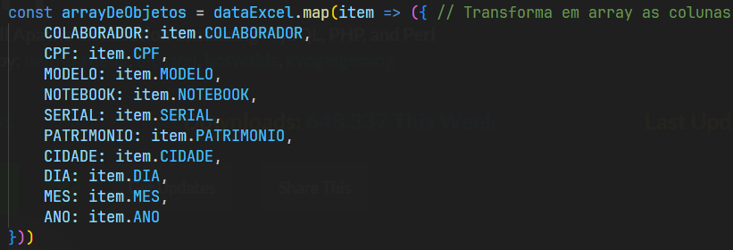

# EditarWordEmMassa
- Editar arquivos word em massa utilizando Node.JS

## Instalação:
- Execute os comandos: npm i express npm i path npm i fs npm i docxtemplater npm i pizzip npm i xlsx

## Como usar?
- Entre na pasta "doc"
- Entre no arquivo "modelo.docx" ele é o nosso modelo que irá ser gerado, edite como quiser, as variáveis deve estar entre chaves "{}"
- Entre no arquivo "modelo-excel.xlsx" ele é o local onde iremos capturar os dados, adicione como necessário
- Após editar os dois arquivos, adicione as variáveis que você incluiu no "modelo.docx"

- Execute o node no terminal com: node server.js

## Sobre o projeto
Para o pessoal do financeiro ou administração da sua empresa! Imagine quantos arquivos do word devem colocar na mão mesmo sendo um template único... Até mesmo para controle de Notebooks, como é o exemplo que temos hoje aqui (para o pessoal de Infra que deve controlar o estoque de máquinas), você pode ajudar eles ou até mesmo pessoas da sua família com isso!